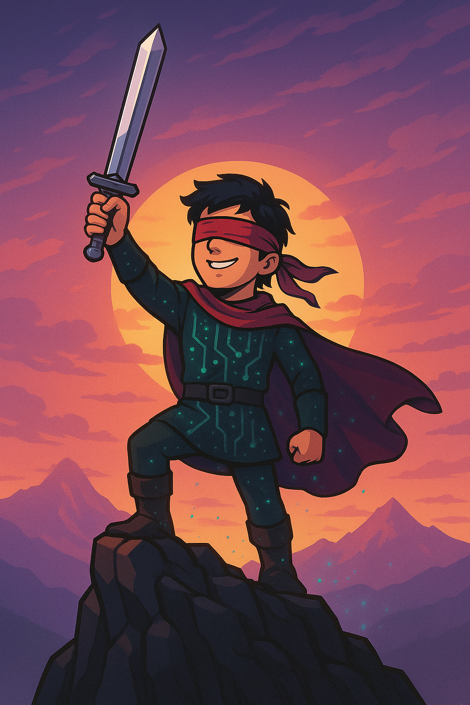

# NATHAN Console

## How it began

The NATHAN console was born from a desire to create something meaningful—for an incredible person: **Nathan Therrien**.

I met Nathan in high school. He was one of those rare people who naturally brighten the world around them. Always smiling, always the first to say hello, to crack a joke, to make everyone around him feel good. We shared the same class in our final year, and even then, I was amazed by his radiant energy.

After high school, life took us in different directions. But I kept following Nathan online—especially through his Facebook page, where he shares videos of his musical explorations. Because yes, on top of everything else, **Nathan is an outstanding musician** and a passionate synthesizer enthusiast.

One morning in year 2022, Nathan made a post looking for help with 3D printing and soldering. At that time, I was just diving into the world of programming, microcontrollers, and digital fabrication. I was eager to learn and build something real. The moment I saw his message, I knew: **this was the project I had been waiting for**.

Working with Nathan—someone I had admired for years—gave me the perfect opportunity to grow my skills while collaborating with someone truly inspiring. He would be part of the process: designing the sounds, shaping the ideas, and even learning to code. From the start, the goal was clear: **build something together that he could one day fully own**.

Since 2022, this journey has become a shared adventure. Today, I’m proud to present the first version of the console:
**NATHAN — Narrative Audio Terminal for Humans with Alternative Navigation**.

As time becomes more limited for me, my hope is to pass the torch. I want the community to take this project further—to make it bigger, better, and even more inclusive.

---

## What is NATHAN?

**NATHAN** is an open source game console powered by a Raspberry Pi Pico, specifically designed for blind or visually impaired players.

Inspired by the form of an Xbox controller, the device includes:

* 5 tactile buttons
* 5 LED indicators
* An integrated audio output
  Together, these features enable an immersive and fully accessible gaming experience.

---

## Features

* 🎮 **Ergonomic form** – Inspired by the Xbox controller for comfortable use
* 🔘 **5 physical buttons** – Easily distinguishable for gameplay
* 💡 **5 LED indicators** – Optional visual feedback
* 🔊 **Audio output** – For immersive, sound-based gameplay
* ♿ **Inclusive game design** – Every game is made for accessibility

---

## Game Concept

Each game on the NATHAN console features a **blind protagonist named Nathan**.

The current flagship game, **NATHAN: Glassbreaker**, puts you in the role of Nathan—a hero who fights and navigates *only* through sound. It's a game where your ears become your eyes, and audio becomes your primary interface with the world.

---

## Open Source & Community

NATHAN is proudly open source.

This project is a call to creators, developers, makers, and dreamers:
**Let’s build accessible games together.**

Whether you want to:

* Design new games tailored for blind players
* Improve the hardware or firmware
* Suggest ideas to enhance the console
  Your contribution is welcome.

---

## Name Meaning

> **NATHAN** = *Narrative Audio Terminal for Humans with Alternative Navigation*

A console built around sound, for a hero—and a community—that navigates the world differently.

---

> 🎙️ *Together, let’s make gaming accessible to everyone.*

---

